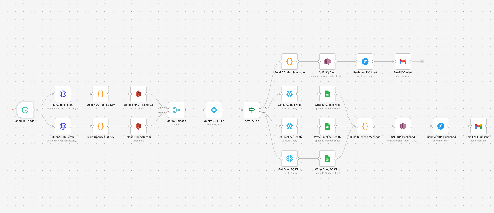

# DQ Agent — Automated Data Quality Monitoring Pipeline

An end-to-end **data quality monitoring system** that ingests public datasets, runs
automated DQ checks across a medallion architecture, publishes KPIs, and sends
real-time alerts on failures — orchestrated with n8n and built on AWS + Snowflake.

---

## Architecture

```
                    ┌───────────────┐
   NYC Taxi API ───▶│               │
                    │     n8n       │──▶ AWS S3 (landing) ──▶ Snowflake
   OpenAQ API   ───▶│ (orchestrator)│      data lake          (Bronze→Silver→Gold)
                    └───────────────┘                             │
                            │                                     ▼
                            │                          DQ checks + KPI marts
                            ▼                                     │
              Alerts (SNS / Email / Pushover) ◀───────────────────┘
                            │
                            ▼
                  Google Sheets KPI dashboard
```

**Medallion architecture:** Bronze (raw ingest) → Silver (DQ-validated) → Gold (KPI marts).

---

## What it does

1. **Ingests** two public datasets on a daily schedule — NYC Taxi trips and OpenAQ
   air-quality readings for India.
2. **Lands** raw data in an S3 data lake, partitioned by source and timestamp.
3. **Loads** into Snowflake via Snowpipe, transforms through Bronze → Silver → Gold.
4. **Runs data quality checks** — null checks, schema validation, range checks
   (fare bounds, geo bounds), and freshness — logging results to a DQ audit table.
5. **Publishes KPIs** (daily taxi revenue, air-quality thresholds, pipeline health)
   to a Google Sheets dashboard.
6. **Alerts** on critical failures via AWS SNS, email, and Pushover push notifications.

---

## Tech Stack

| Layer | Technology |
|-------|-----------|
| Orchestration | n8n (self-hosted) |
| Data lake | AWS S3 |
| Warehouse | Snowflake (medallion: Bronze/Silver/Gold) |
| Ingestion | Snowpipe |
| Alerting | AWS SNS, Gmail, Pushover |
| Dashboard | Google Sheets API |
| IaC | Terraform (AWS resources) |
| Datasets | NYC Open Data (Taxi), OpenAQ v3 (air quality) |

---

## Repository Structure

```
dq-agent/
├── n8n-workflow/
│   └── DQM_wf_v1.json          # Full orchestration workflow (importable)
├── snowflake/                  # 14 SQL files — full warehouse build
│   ├── 01_dq_engineering.sql   # DQ framework tables
│   ├── 02_storage_integration.sql
│   ├── 03_snowpipe_view.sql
│   ├── 04_views_bronze.sql
│   ├── 05_dq_rules_silver.sql
│   ├── 06_bronze_to_silver_sql_task.sql
│   ├── ...
│   └── 14_openaq_dq_checks.sql
├── terraform/                  # AWS infrastructure as code
├── scripts/                    # Python ingestion + dashboard utilities
└── docs/                       # Architecture spec + diagrams
```

---

## Data Quality Checks Implemented

| Check | Dataset | Example |
|-------|---------|---------|
| Null check | Both | Required fields not null |
| Schema validation | Both | Column types match contract |
| Range check | NYC Taxi | Fare within plausible bounds |
| Geo bounds | NYC Taxi | Pickup/dropoff within NYC |
| WHO threshold | OpenAQ | PM2.5 against WHO air-quality limits |
| Freshness | Both | Data within expected time window |

Real results achieved on 20K NYC Taxi rows: null/schema checks **PASS**,
fare-range and geo-bounds checks correctly **FAIL** on outliers.

---

## Key Engineering Decisions

- **AWS Bedrock over Vertex AI** for in-pipeline inference — already in the AWS
  ecosystem, cheaper, with multi-model flexibility.
- **n8n Execute Node with standalone Python scripts** rather than inline code, for
  testability and reuse.
- **Snowflake task scheduling lesson:** tasks must be `SUSPEND`ed after testing —
  scheduled tasks firing frequently keep the warehouse alive and incur cost. Always
  pair with a Resource Monitor.

---

## Notes

This is a portfolio project demonstrating data engineering and pipeline orchestration
skills. Credentials are referenced via environment variables and n8n's credential
store — none are committed. The SQL files document the full warehouse build and can
be re-deployed to any Snowflake instance.

## N8N Workflow


